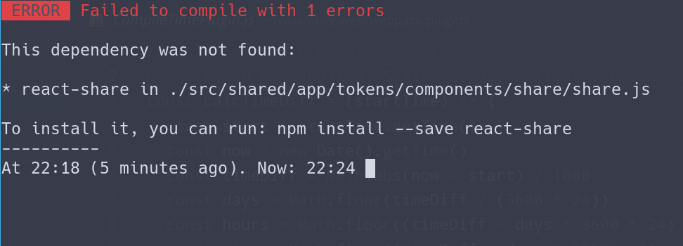

# webpack-compiled-at-plugin

Webpack plugin that displays difference between compile time and now

## Installation

`npm install --save-dev 'webpack-compiled-at-plugin'`

Add plugin in your webpack.config.js:

```javascript
const CompileTimePlugin = require('webpack-compiled-at-plugin');

let config = {
	plugins: [
		new CompileTimePlugin,
	]
};

module.exports = config;
```

And see time of last compilation in your terminal:


